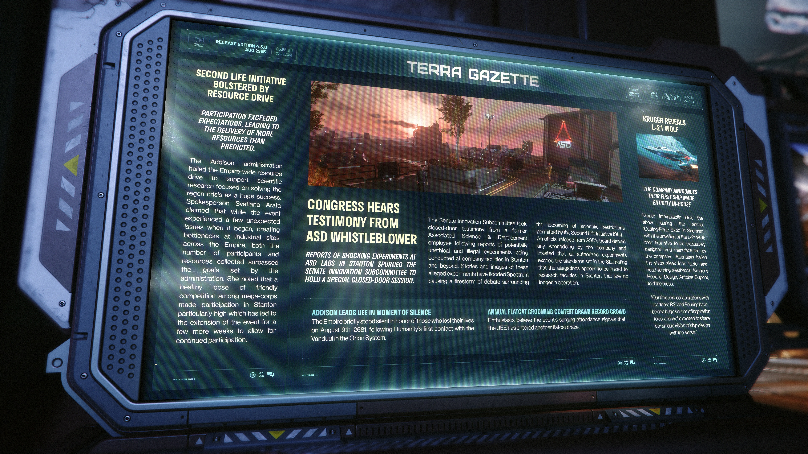

# Alpha 4.3.0：ASD 揭密者聽證會、SLI 資源募集成功與 Kruger L-21 Wolf 發表

---

---

<!-- **RELEASE EDITION 4.3.0** -->

**發佈版本號 4.3.0**

<!-- **AUG 2955** -->

**2955 年 8 月**

---

<!-- ### **TERRA GAZETTE** -->

### **泰拉公報**

---

<!-- ### **Left Column** -->

### **左側欄位**

<!-- **SECOND LIFE INITIATIVE BOLSTERED BY RESOURCE DRIVE** -->

**「第二生命倡議」獲資源募集活動大力支持**

<!-- **PARTICIPATION EXCEEDED EXPECTATIONS, LEADING TO THE DELIVERY OF MORE RESOURCES THAN PREDICTED.** -->

**參與度超出預期，交付的資源超乎預測。**

<!-- The Addison administration hailed the Empire-wide resource drive to support scientific research focused on solving the regen crisis as a huge success.Spokesperson Svetlana Arata claimed that while the event experienced a few unexpected issues when it began, creating bottlenecks at industrial sites across the Empire, both the number of participants and resources collected surpassed the goals set by the administration. She noted that a healthy dose of friendly competition among mega-corps made participation in Stanton particularly high which has led to the extension of the event for a few more weeks to allow for continued participation. -->

Addison 政府稱讚全帝國範圍內為支持解決再生危機的科學研究所進行的資源募集活動取得了巨大成功。發言人 Svetlana Arata 聲稱，儘管活動開始時遇到了一些意想不到的問題，導致帝國各地的工業區出現瓶頸，但參與者人數和收集的資源都超過了政府設定的目標。她指出，大型企業之間良性的友好競爭使得斯坦頓的參與度尤其高，這導致活動延長了幾週，以便讓參與得以持續。

---

<!-- ### **Center Column** -->

### **中間欄位**

<!-- **CONGRESS HEARS TESTIMONY FROM ASD WHISTLEBLOWER** -->

**國會聽取來自 ASD 揭密者的證詞**

<!-- **REPORTS OF SHOCKING EXPERIMENTS AT ASD LABS IN STANTON SPURNED THE SENATE INNOVATION SUBCOMMITTEE TO HOLD A SPECIAL CLOSED-DOOR SESSION.** -->

**關於 ASD 實驗室在 斯坦頓 進行驚人實驗的報導，促使參議院創新小組委員會舉行了一次特別閉門會議。**

<!-- The Senate Innovation Subcommittee took closed-door testimony from a former Associated Science & Development employee following reports of potentially unethical and illegal experiments being conducted at company facilities in Stanton and beyond. Stories and images of these alleged experiments have flooded Spectrum causing a firestorm of debate surrounding the loosening of scientific restrictions permitted by the Second Life Initiative (SLI). An official release from ASD's board denied any wrongdoing by the company and insisted that all authorized experiments exceed the standards set in the SLI, noting that the allegations appear to be linked to research facilities in Stanton that are no longer in operation. -->

參議院創新小組委員會聽取了一名聯合科學與發展公司前員工的閉門證詞，此前有報導稱該公司在斯坦頓及其他地區的設施中進行了潛在不道德和非法的實驗。有關這些所謂實驗的故事和圖片充斥著 Spectrum，引發了一場關於放寬「第二生命倡議」(SLI) 所允許的科學限制的激烈辯論。ASD 董事會發布的官方聲明否認了公司的任何不當行為，並堅稱所有授權實驗均超越了 SLI 中設定的標準，同時指出這些指控似乎與斯坦頓已停止運營的研究設施有關。

---

<!-- ### **Right Column** -->

### **右側欄位**

<!-- **KRUGER REVEALS L-21 WOLF** -->

**KRUGER 揭曉 L-21 WOLF**

<!-- **THE COMPANY ANNOUNCES THEIR FIRST SHIP MADE ENTIRELY IN-HOUSE** -->

**該公司宣布了他們第一艘完全自主研發製造的船艦**

<!-- Kruger Intergalactic stole the show during the annual 'Cutting-Edge Expo in Sherman, with the unveiling of the L-21 Wolf: their first ship to be exclusively designed and manufactured by the company. Attendees hailed the ship's sleek form factor and head-turning aesthetics. Kruger's Head of Design, Antoine Dupont, told the press:
"Our frequent collaborations with partners RSI and Behring have been a huge source of inspiration to us, and were excited to share our unique vision of ship design with the 'verse." -->

Kruger Intergalactic 在 Sherman 舉行的年度「尖端博覽會」上大放異彩，推出了 L-21 Wolf：這是他們第一艘完全由該公司獨家設計和製造的船艦。與會者盛讚該船艦流線型的外觀和引人注目的美學。Kruger 的設計主管 Antoine Dupont 告訴媒體：
「我們與合作夥伴 RSI 和 Behring 的頻繁合作是我們的巨大靈感來源，我們很高興能與宇宙（'verse）分享我們對船艦設計的獨特願景。」

---

### **Footer**

### **底部欄位**

<!-- **ADDISON LEADS UEE IN MOMENT OF SILENCE** -->

**ADDISON 帶領 UEE 舉行默哀**

<!-- The Empire briefly stood silent in honor of those who lost their lives on August 9th, 2681, following Humanity's first contact with the Vanduul in the Orion System. -->

帝國短暫默哀，紀念 2681 年 8 月 9 日在 Orion 星系與剜度首次接觸後喪生的人們。

<!-- **ANNUAL FLATCAT GROOMING CONTEST DRAWS RECORD CROWD** -->

**年度扁臉貓美容大賽吸引了創紀錄的人潮**

<!-- Enthusiasts believe the events surging attendance signals that the UEE has entered another flatcat craze. -->

愛好者認為，活動參與人數激增，標誌著 UEE 已進入另一波扁臉貓熱潮。
