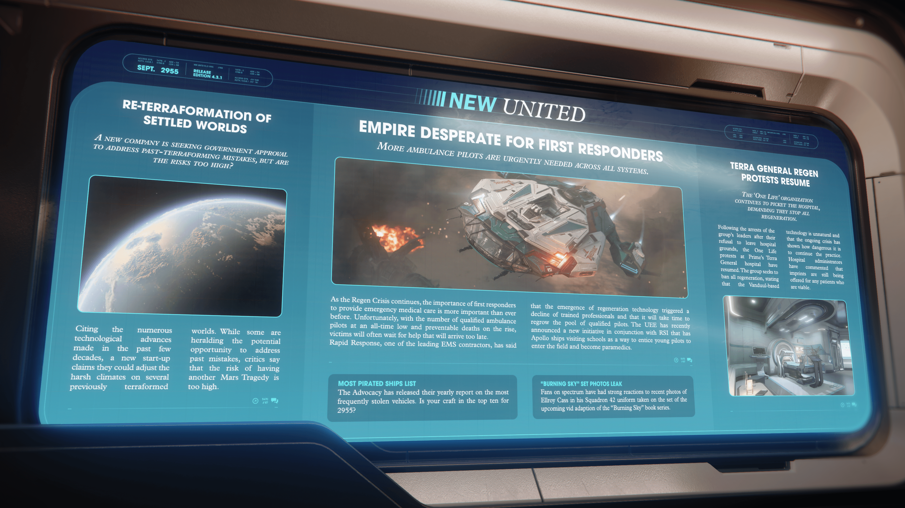

# Alpha 4.3.1 新創公司提議「再地球化」引發風險爭議、再生危機致急救人員嚴重短缺、抗議組織要求醫院停止再生醫療

---

---

<!-- **SEPT. 2955** -->

**2955 年 9 月**

<!-- **RELEASE EDITION 4.3.1** -->

**發佈版本號 4.3.1**

---

<!-- ### **NEW UNITED** -->

### **新聯合報**

---

<!-- ### **Left Column** -->

### **左側欄位**

<!-- **RE-TERRAFORMATION OF SETTLED WORLDS** -->

**已定居世界的再地球化**

<!-- **A NEW COMPANY IS SEEKING GOVERNMENT APPROVAL TO ADDRESS PAST-TERRAFORMING MISTAKES, BUT ARE THE RISKS TOO HIGH?** -->

**一家新公司正尋求政府批准，以解決過去地球化改造的錯誤，但風險是否過高？**

<!-- Citing the numerous technological advances made in the past few decades, a new start-up claims they could adjust the harsh climates on several previously terraformed worlds. While some are heralding the potential opportunity to address past mistakes, critics say that the risk of having another Mars Tragedy is too high. -->

一家新創公司聲稱，憑藉過去幾十年取得的眾多技術進步，他們可以調整幾個先前已地球化世界的惡劣氣候。儘管有些人預示這可能是解決過去錯誤的潛在機會，但批評者表示，再次發生「火星悲劇」的風險太高。

---

<!-- ### **Center Column** -->

### **中間欄位**

<!-- **EMPIRE DESPERATE FOR FIRST RESPONDERS** -->

**帝國急需急救人員**

<!-- **MORE AMBULANCE PILOTS ARE URGENTLY NEEDED ACROSS ALL SYSTEMS.** -->

**所有星系均迫切需要更多救護車飛行員。**

<!-- As the Regen Crisis continues, the importance of first responders to provide emergency medical care is more important than ever before. Unfortunately, with the number of qualified ambulance pilots at an all-time low and preventable deaths on the rise, victims will often wait for help that will arrive too late. Rapid Response, one of the leading EMS contractors, has said that the emergence of regeneration technology triggered a decline of trained professionals and that it will take time to regrow the pool of qualified pilots. The UEE has recently
announced a new initiative in conjunction with RSI that has Apollo ships visiting schools as a way to entice young pilots to enter the field and become paramedics. -->

隨著「再生危機」持續，提供緊急醫療服務的急救人員比以往任何時候都更加重要。不幸的是，合格救護車飛行員的數量創下歷史新低，可預防的死亡人數卻不斷上升，受害者往往只能等待遲來的救援。領先的緊急醫療服務承包商之一「快速反應」表示，再生技術的出現導致訓練有素的專業人員減少，並且需要時間才能重新培養足夠的合格飛行員。UEE 最近宣布了一項與 RSI 合作的新計劃，讓阿波羅號船艦訪問學校，以吸引年輕飛行員投身該領域並成為護理人員。

---

<!-- ### **Right Column** -->

### **右側欄位**

<!-- **TERRA GENERAL REGEN PROTESTS RESUME** -->

**泰拉綜合醫院「再生」抗議活動重燃**

<!-- **THE 'ONE LIFE' ORGANIZATION CONTINUES TO PICKET THE HOSPITAL, DEMANDING THEY STOP ALL REGENERATION.** -->

**「一次生命」組織持續在醫院外舉行抗議，要求他們停止所有再生醫療。**

<!-- Following the arrests of the group's leaders after their refusal to leave hospital grounds, the One Life protests at Prime's Terra General hospital have resumed. The group seeks to ban all regeneration, stating that the Vanduul-based technology is unnatural and that the ongoing crisis has shown how dangerous it is to continue the practice. Hospital administrators have commented that imprints are still being offered for any patients who are viable. -->

在該組織領導人因拒絕離開醫院範圍而被捕後，「一次生命」在泰拉星普萊姆綜合醫院的抗議活動又重新開始。該組織尋求禁止所有再生醫療，稱這項基於剜度的技術是不自然的，而且持續的危機表明繼續這種做法是多麼危險。醫院管理人員評論說，他們仍在為任何合適的患者提供「印記」。

---

<!-- ### **Footer** -->

### **底部欄位**

<!-- **MOST PIRATED SHIPS LIST** -->

**最常遭海盜劫持的船艦清單**

<!-- The Advocacy has released their yearly report on the most frequently stolen vehicles. Is your craft in the top ten for
2955？ -->

倡議局發布了關於最常被盜載具的年度報告。您的船艦是否名列 2955 年的前十名？

<!-- **"BURNING SKY" SET PHOTOS LEAK** -->

**《燃燒的天空》片場照片外流**

<!-- Fans on spectrum have had strong reactions to recent photos of Ellroy Cass in his Squadron 42 uniform taken on the set of the upcoming vid adaption of the "Burning Sky" book series. -->

粉絲們在光譜上對 Ellroy Cass 穿著 42 中隊制服的片場照片反應強烈，這些照片是在即將上映的《燃燒的天空》系列叢書改編影片的片場拍攝的。
