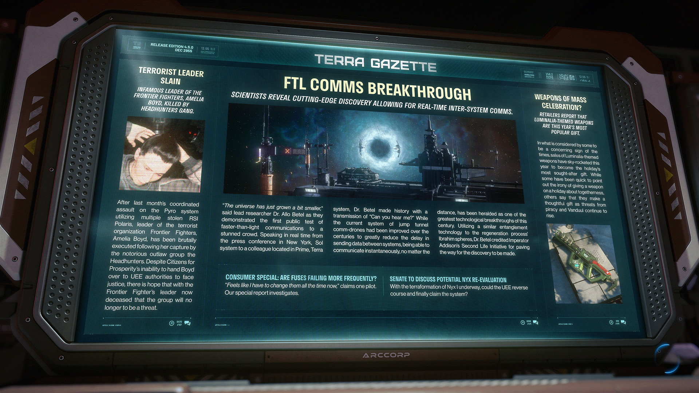

# Alpha 4.5.0：恐怖組織頭目遭獵頭幫處決、超光速即時通訊技術問世、光明節主題武器成熱門禮物

---

---

<!-- **RELEASE EDITION 4.5** -->

**發行版本 4.5**

<!-- **DEC 2955** -->

**2955 年 12 月**

---

<!-- ### **TERRA GAZETTE** -->

### **泰拉公報**

---

<!-- **TERRORIST LEADER SLAIN** -->

**恐怖份子頭目被殺**

<!-- **INFAMOUS LEADER OF THE FRONTIER FIGHTERS, AMELIA BOYD, KILLED BY HEADHUNTERS GANG.** -->

**惡名昭彰的邊境戰士領袖阿梅莉亞·博伊德遭獵頭幫 (Headhunters) 殺害。**

<!-- After last month's coordinated assault on the Pyro system utilizing multiple stolen RSI Polaris, leader of the terrorist organization Frontier Fighters, Amelia Boyd, has been brutally executed following her capture by the notorious outlaw group the Headhunters. Despite Citizens for Prosperity's inability to hand Boyd over to UEE authorities to face justice, there is hope that with the Frontier Fighter's leader now deceased that the group will no longer to be a threat. -->

在上個月利用多艘被盜的羅伯茨太空工業北極星對派羅星系發動協同攻擊後，恐怖組織「邊境戰士」的領袖阿梅莉亞·博伊德在被惡名昭彰的非法組織獵頭幫俘虜後遭到殘忍處決。儘管「繁榮公民」組織無法將博伊德移交給聯合地球帝國當局接受正義審判，但人們希望隨著邊境戰士領袖的死亡，該組織將不再構成威脅。

---

<!-- **FTL COMMS BREAKTHROUGH** -->

**超光速通訊突破**

<!-- **SCIENTISTS REVEAL CUTTING-EDGE DISCOVERY ALLOWING FOR REAL-TIME INTER-SYSTEM COMMS.** -->

**科學家揭露尖端發現，實現即時跨星系通訊。**

<!-- "The universe has just grown a bit smaller," said lead researcher Dr. Allo Betel as they demonstrated the first public test of faster-than-light communications to a stunned crowd. Speaking in real time from the press conference in New York, Sol system to a colleague located in Prime, Terra system, Dr. Betel made history with a transmission of "Can you hear me?" While the current system of jump tunnel comm-drones had been improved over the centuries to greatly reduce the delay in sending data between systems, being able to communicate instantaneously, no matter the distance, has been heralded as one of the greatest technological breakthroughs of this century. Utilizing a similar entanglement technology to the regeneration process Ibrahim spheres, Dr. Betel credited Imperator Addison's Second Life Initiative for paving the way for the discovery to be made. -->

「宇宙剛剛變小了一點，」首席研究員阿洛·貝特爾博士在向震驚的群眾展示首次公開測試的超光速通訊時說道。貝特爾博士從位於太陽系紐約的新聞發布會現場，向位於泰拉星系普萊姆的一位同事即時發話，以一句「你能聽到我說話嗎？」創造了歷史。雖然跳躍通道通訊無人機系統在過去幾個世紀中已有所改進，大幅減少了星系間傳送數據的延遲，但無論距離多遠都能夠進行瞬間通訊，被譽為本世紀最偉大的技術突破之一。利用與伊布拉欣球再生過程類似的糾纏技術，貝特爾博士歸功於艾迪森皇帝的「第二生命倡議」，認為這為此項發現鋪平了道路。

---

<!-- **WEAPONS OF MASS CELEBRATION?** -->

**大規模慶祝武器？**

<!-- **RETAILERS REPORT THAT LUMINALIA-THEMED WEAPONS ARE THIS YEAR'S MOST POPULAR GIFT.** -->

**零售商報告指出，光明節主題武器是今年最受歡迎的禮物。**

<!-- In what is considered by some to be a concerning sign of the times, sales of Luminalia-themed weapons have sky-rocketed this year to become the holiday's most sought-after gift. While some have been quick to point out the irony of giving a weapon on a holiday about togetherness, others say that they make a thoughtful gift as threats from piracy and Vanduul continue to rise. -->

在一些人認為這是令人擔憂的時代跡象中，光明節主題武器的銷量在今年激增，成為節日最受追捧的禮物。雖然有些人迅速指出在一個象徵團聚的節日贈送武器具有諷刺意味，但其他人則表示，隨著來自海盜和剜度 (Vanduul) 的威脅持續上升，這是一份貼心的禮物。

---

<!-- **CONSUMER SPECIAL: ARE FUSES FAILING MORE FREQUENTLY?** -->

**消費者特輯：保險絲故障是否越來越頻繁？**

<!-- "Feels like I have to change them all the time now," claims one pilot.
Our special report investigates. -->

「感覺我現在必須一直更換它們，」一位飛行員聲稱。
我們的特別報導將進行調查。

<!-- **SENATE TO DISCUSS POTENTIAL NYX RE-EVALUATION** -->

**參議院將討論重新評估尼克斯的可能性**

<!-- With the terraformation of Nyx I underway, could the UEE reverse course and finally claim the system? -->

隨著尼克斯 I 的地球化改造正在進行，聯合地球帝國是否會改變方針並最終宣稱該星系的主權？
