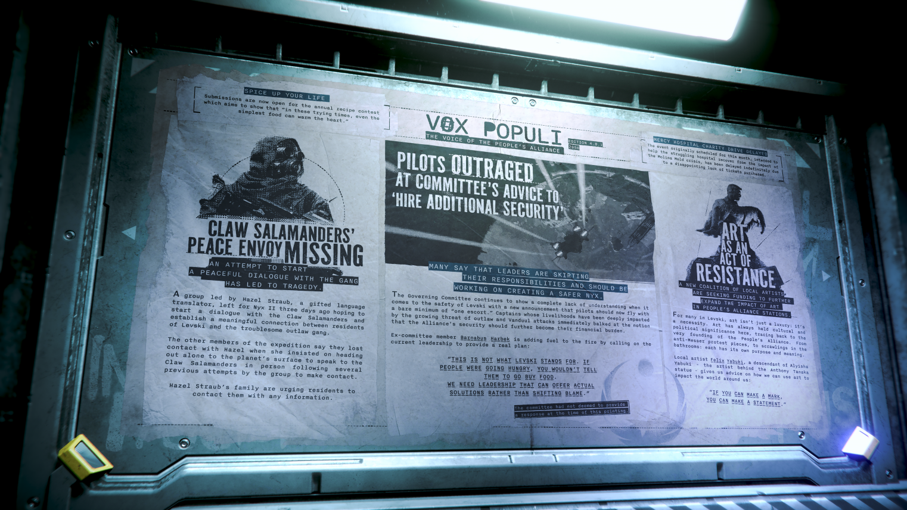

# Alpha 4.8.1：爪蠑螈和平使者失蹤、飛行員對委員會建議「聘請額外安全人員」感到憤怒、藝術作為抵抗的行為

---

---

<!-- **RELEASE EDITION 4.8.1** -->

**發佈版本 4.8.1**

<!-- **2956** -->

**2956 年**

---

<!-- **VOX POPULI - THE VOICE OF THE PEOPLE'S ALLIANCE** -->

**VOX POPULI - 人民聯盟之聲**

---

<!-- **SPICE UP YOUR LIFE** -->

**為生活增添風味**

<!-- Submissions are now open for the annual recipe contest which aims to show that "in these trying times, even the simplest food can warm the heart." -->

年度食譜大賽現已開放投稿，該活動旨在展示「在這些艱難的時期，即使是最簡單的食物也能溫暖人心。」

---

<!-- **MERCY HOSPITAL CHARITY DRIVE DELAYED** -->

**仁慈醫院 (Mercy Hospital) 慈善募款活動延期**

<!-- The event originally scheduled for this month, intended to help the struggling hospital recover from the impact of the Molina Mold crisis, has been delayed indefinitely due to a disappointing lack of tickets purchased. -->

原定於本月舉行、旨在幫助這家陷入困境的醫院從莫里納黴菌 (Molina Mold) 危機影響中恢復的活動，因門票售出情況令人失望而無限期延期。

---

<!-- **CLAW SALAMANDERS' PEACE ENVOY MISSING** -->

**爪蠑螈 (Claw Salamanders) 和平使者失蹤**

<!-- **AN ATTEMPT TO START A PEACEFUL DIALOGUE WITH THE GANG HAS LED TO TRAGEDY.** -->

**試圖與該幫派展開和平對話的嘗試已導致悲劇。**

<!-- A group led by Hazel Straub, a gifted language translator, left for Nyx II three days ago hoping to start a dialogue with the Claw Salamanders and establish a meaningful connection between residents of Levski and the troublesome outlaw gang. -->

由富有語言天賦的翻譯家 Hazel Straub 率領的團隊於三天前出發前往尼克斯 II (Nyx II)，希望能與爪蠑螈 (Claw Salamanders) 展開對話，並在列夫斯基 (Levski) 居民與這個棘手的歹徒幫派之間建立有意義的聯繫。

<!-- The other members of the expedition say they lost contact with Hazel when she insisted on heading out alone to the planet's surface to speak to the Claw Salamanders in person following several previous attempts by the group to make contact. -->

探險隊的其他成員表示，在該團隊幾次嘗試接觸後，Hazel 堅持獨自前往行星表面與爪蠑螈 (Claw Salamanders) 親自交談，隨後他們便與她失去了聯繫。

<!-- Hazel Straub's family are urging residents to contact them with any information. -->

Hazel Straub 的家人正敦促居民如有任何線索請與他們聯繫。

---

<!-- **PILOTS OUTRAGED AT COMMITTEE'S ADVICE TO 'HIRE ADDITIONAL SECURITY'** -->

**飛行員對委員會建議「聘請額外安全人員」感到憤怒**

<!-- **MANY SAY THAT LEADERS ARE SKIRTING THEIR RESPONSIBILITIES AND SHOULD BE WORKING ON CREATING A SAFER NYX.** -->

**許多人表示領導者正在規避責任，應致力於創造一個更安全的尼克斯 (Nyx)。**

<!-- The Governing Committee continues to show a complete lack of understanding when it comes to the safety of Levski with a new announcement that pilots should now fly with a bare minimum of "one escort." Captains whose livelihoods have been deeply impacted by the growing threat of outlaw and Vanduul attacks immediately balked at the notion that the Alliance's security should further become their financial burden. -->

管理委員會在對待列夫斯基 (Levski) 的安全問題上繼續表現出完全的無知，他們最新宣布飛行員現在飛行時應至少配備「一名護航員」。生計受到日益嚴重的歹徒與 Vanduul 襲擊威脅深切影響的船長們，立即對聯盟的安全應進一步成為他們財務負擔的說法感到反感。

<!-- Ex-committee member Barnabus Harbek is adding fuel to the fire by calling on the current leadership to provide a real plan: -->

前委員會成員 Barnabus Harbek 呼籲現任領導層提供一項真正的計劃，這無疑是火上澆油：

<!-- > "THIS IS NOT WHAT LEVSKI STANDS FOR. IF PEOPLE WERE GOING HUNGRY, YOU WOULDN'T TELL THEM TO GO BUY FOOD. WE NEED LEADERSHIP THAT CAN OFFER ACTUAL SOLUTIONS RATHER THAN SHIFTING BLAME." -->

> 「這不是列夫斯基 (Levski) 創立的宗旨。如果人們快要挨餓，你不會叫他們去買食物。我們需要的是能夠提供實際解決方案的領導層，而不是推卸責任。」

<!-- The committee had not deemed to provide a response at the time of this printing. -->

截至本刊印前，委員會並未對此做出任何回應。

---

<!-- **ART AS AN ACT OF RESISTANCE** -->

**藝術作為抵抗的行為**

<!-- **A NEW COALITION OF LOCAL ARTISTS ARE SEEKING FUNDING TO FURTHER EXPAND THE IMPACT OF ART IN PEOPLE'S ALLIANCE STATIONS.** -->

**一個由當地藝術家組成的新聯盟正在尋求資金，以進一步擴大藝術在人民聯盟 (People's Alliance) 站點中的影響力。**

<!-- For many in Levski, art isn't just a luxury: it's a necessity. Art has always held cultural and political significance here, tracing back to the very founding of the People's Alliance. From anti-Messer protest pieces, to scrawlings in the bathrooms; each has its own purpose and meaning. -->

對於列夫斯基 (Levski) 的許多人來說，藝術不只是一件奢侈品，它是一項必需品。從人民聯盟 (People's Alliance) 創立之初，藝術在此處便一直具有文化與政治意義。從反麥瑟 (anti-Messer) 的抗議作品，到洗手間裡的塗鴉，每一件都有其獨特的宗旨與意義。

<!-- Local artist Felix Yabuki, a descendant of Alyisha Yabuki - the artist behind the Anthony Tanaka statue - gives us advice on how we can use art to impact the world around us: -->

當地藝術家 Felix Yabuki 是 Anthony Tanaka 雕像創作者 Alyisha Yabuki 的後裔，他為我們如何利用藝術影響周遭世界提供了建議：

<!-- > "IF YOU CAN MAKE A MARK, YOU CAN MAKE A STATEMENT." -->

> 「如果你能留下印記，你就能表明立場。」
