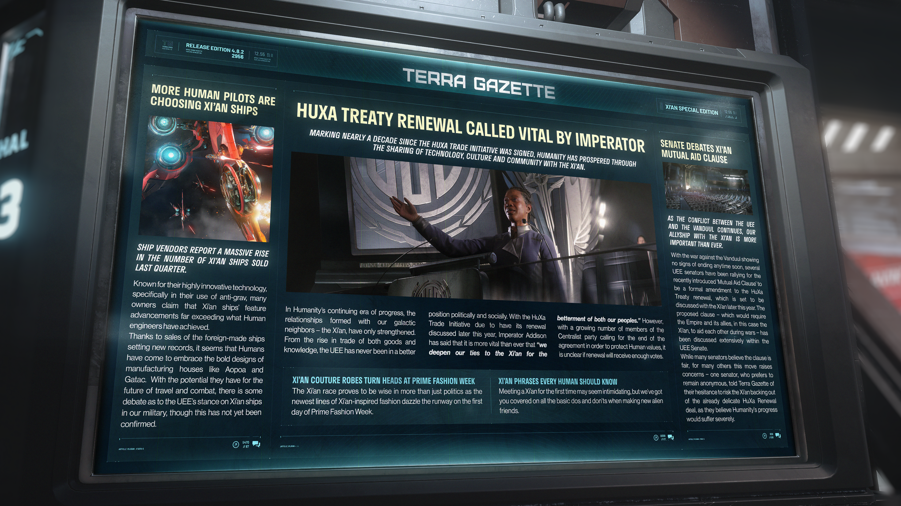

# Alpha 4.8.2：皇帝稱續簽西安條約至關重要、人類飛行員青睞西安飛船、參議院辯論西安互助條款

---

---

<!-- **RELEASE EDITION 4.8.2** -->

**發佈版本 4.8.2**

<!-- **2956** -->

**2956 年**

---

<!-- **TERRA GAZETTE - XI'AN SPECIAL EDITION** -->

**TERRA GAZETTE - 泰拉公報：西安特別版**

---

<!-- **MORE HUMAN PILOTS ARE CHOOSING XI'AN SHIPS** -->

**更多人類飛行員選擇西安飛船**

<!-- **SHIP VENDORS REPORT A MASSIVE RISE IN THE NUMBER OF XI'AN SHIPS SOLD LAST QUARTER.** -->

**飛船經銷商報告上季度西安 (Xi'an) 飛船銷售量大幅增長。**

<!-- Known for their highly innovative technology, specifically in their use of anti-grav, many owners claim that Xi'an ships' feature advancements far exceeding what Human engineers have achieved. -->

西安 (Xi'an) 飛船以其高度創新的技術（特別是反重力技術的使用）而聞名，許多船主聲稱西安飛船的技術進步已遠遠超越人類工程師所達到的水平。

<!-- Thanks to sales of the foreign-made ships setting new records, it seems that Humans have come to embrace the bold designs of manufacturing houses like Aopoa and Gatac. With the potential they have for the future of travel and combat, there is some debate as to the UEE's stance on Xi'an ships in our military, though this has not yet been confirmed. -->

隨著這款外國製造飛船的銷量創下新紀錄，人類似乎已開始接受奧波亞 (Aopoa) 和蓋塔克 (Gatac) 等製造商的大膽設計。鑑於這些飛船在未來旅行與戰鬥中的潛力，目前對於聯合地球帝國 (UEE) 讓西安飛船加入我軍的立場存在一些爭論，儘管這一點尚未得到證實。

---

<!-- **HUXA TREATY RENEWAL CALLED VITAL BY IMPERATOR** -->

**皇帝稱續簽西安條約至關重要**

<!-- **MARKING NEARLY A DECADE SINCE THE HUXA TRADE INITIATIVE WAS SIGNED, HUMANITY HAS PROSPERED THROUGH THE SHARING OF TECHNOLOGY, CULTURE AND COMMUNITY WITH THE XI'AN.** -->

**標誌著自《HuXa 貿易倡議》簽署近十年以來，人類藉由與西安 (Xi'an) 分享技術、文化和社群而繁榮發展。**

<!-- In Humanity's continuing era of progress, the relationships formed with our galactic neighbors - the Xi'an, have only strengthened. From the rise in trade of both goods and knowledge, the UEE has never been in a better position politically and socially. With the HuXa Trade Initiative due to have its renewal discussed later this year, Imperator Addison has said that it is more vital than ever that "we deepen our ties to the Xi'an for the betterment of both our peoples." However, with a growing number of members of the Centralist party calling for the end of the agreement in order to protect Human values, it is unclear if renewal will receive enough votes. -->

在人類持續進步的時代中，與我們銀河鄰居——西安 (Xi'an) 建立的關係日益鞏固。從物資到知識貿易的興起，聯合地球帝國 (UEE) 在政治與社會層面上均處於前所未有的極佳狀態。隨著《HuXa 貿易倡議》將於今年晚些時候進行續約討論，艾迪森 (Addison) 皇帝表示，「為了我們雙方人民的福祉，深化我們與西安的聯繫」比以往任何時候都更為關鍵。然而，隨著越來越多中庸黨 (Centralist) 成員為了保護人類的價值觀而呼籲終止該協定，目前尚不清楚續約是否能獲得足夠的票數支援。

---

<!-- **XI'AN COUTURE ROBES TURN HEADS AT PRIME FASHION WEEK** -->

**西安高級訂製長袍在普萊姆 (Prime) 時裝週引人矚目**

<!-- The Xi'an race proves to be wise in more than just politics as the newest lines of Xi'an-inspired fashion dazzle the runway on the first day of Prime Fashion Week. -->

西安 (Xi'an) 族證明了他們不僅在政治上充滿智慧，其最新款的西安風尚系列服飾在普萊姆 (Prime) 時裝週首日便閃耀伸展台。

---

<!-- **XI'AN PHRASES EVERY HUMAN SHOULD KNOW** -->

**每個人類都應該知道的西安 (Xi'an) 片語**

<!-- Meeting a Xi'an for the first time may seem intimidating, but we've got you covered on all the basic dos and don'ts when making new alien friends. -->

初次與西安 (Xi'an) 接觸可能會感到有些畏懼，但我們為您整理了在結交新外星朋友時的所有基本注意事項與禁忌。

---

<!-- **SENATE DEBATES XI'AN MUTUAL AID CLAUSE** -->

**參議院辯論西安 (Xi'an) 互助條款**

<!-- **AS THE CONFLICT BETWEEN THE UEE AND THE VANDUUL CONTINUES, OUR ALLYSHIP WITH THE XI'AN IS MORE IMPORTANT THAN EVER.** -->

**隨著 UEE 與剜度 (Vanduul) 之間的衝突持續，我們與西安 (Xi'an) 的盟友關係比以往任何時候都更為重要。**

<!-- With the war against the Vanduul showing no signs of ending anytime soon, several UEE senators have been rallying for the recently introduced 'Mutual Aid Clause' to be a formal amendment to the HuXa Treaty renewal, which is set to be discussed with the Xi'an later this year. The proposed clause - which would require the Empire and its allies, in this case the Xi'an, to aid each other during wars - has been discussed extensively within the UEE Senate. -->

由於與剜度 (Vanduul) 的戰爭短期內沒有結束的跡象，數名 UEE 參議員一直極力爭取將最近提出的「互助條款 (Mutual Aid Clause)」作為《HuXa 條約》續簽的正式修正案，該條約將於今年晚些時候與西安 (Xi'an) 進行討論。這項擬議的條款——要求帝國及其盟友（在此指西安）在戰爭期間互相援助——已在 UEE 參議院內部進行了廣泛的討論。

<!-- While many senators believe the clause is fair, for many others this move raises concerns - one senator, who prefers to remain anonymous, told Terra Gazette of their hesitance to risk the Xi'an backing out of the already delicate HuXa Renewal deal, as they believe Humanity's progress would suffer severely. -->

儘管許多參議員認為該條款是合理的，但對其他許多人來說，此舉引發了擔憂——一位要求匿名的參議員告訴《泰拉公報》 (Terra Gazette)，他們遲疑是否要冒著讓西安 (Xi'an) 退出本已脆弱的《HuXa 續簽》談判的風險，因為他們深信，如果沒有此合約，人類的發展進步將遭受嚴重打擊。
