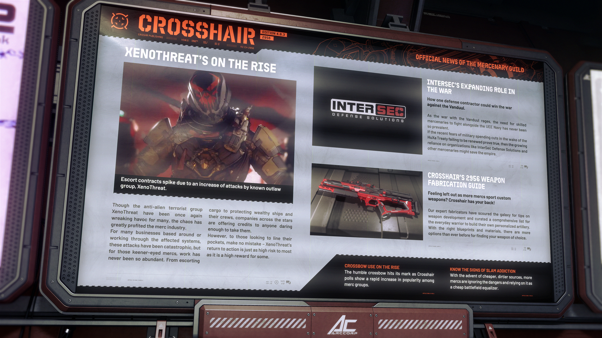

# Alpha 4.8.3：XenoThreat 襲擊增加護航需求激增、InterSec 對削減軍費表憂慮、公會發佈 2956 武器製造指南

> **發佈版本：** 4.8.3 | **年份：** 2956 年 | **來源：** CROSSHAIR - 準心 (傭兵公會官方新聞)

---

<!-- **XENOTHREAT'S ON THE RISE** -->

## XenoThreat 勢力崛起

<!-- **Escort contracts spike due to an increase of attacks by known outlaw group, XenoThreat.** -->

> **由於已知非法組織 XenoThreat 的襲擊增加，護航合約數量激增。**

<!-- Though the anti-alien terrorist group XenoThreat have been once again wreaking havoc for many, the chaos has greatly profited the merc industry. For many businesses based around or working through the affected systems, these attacks have been catastrophic, but for those keener-eyed mercs, work has never been so abundant. From escorting cargo to protecting wealthy ships and their crews, companies across the stars are offering credits to anyone daring enough to take them. However, to those looking to line their pockets, make no mistake - XenoThreat's return to action is just as high risk to most as it is a high reward for some. -->

儘管排外恐怖組織 XenoThreat 再次給許多人帶來災難，但這種混亂卻讓傭兵行業大獲其利。對於許多在受影響星系內或透過這些星系營運的企業來說，這些襲擊是災難性的，但對於那些眼光敏銳的傭兵來說，工作機會從未如此豐富。從護送貨物到保護富裕的飛船及其船員，星際間的公司正向任何膽敢接單的人提供信用點。然而，對於那些想要填滿自己口袋的人來說，別搞錯了——XenoThreat 的重返行動對大多數人來說是極高風險，正如對某些人來說是高回報一樣。

<!-- **INTERSEC'S EXPANDING ROLE IN THE WAR** -->

## InterSec 在戰爭中的角色不斷擴大

<!-- **How one defense contractor could win the war against the Vanduul.** -->

> **一家國防承包商如何能贏得對抗剜度 (Vanduul) 的戰爭。**

<!-- As the war with the Vanduul rages, the need for skilled mercenaries to fight alongside the UEE Navy has never been so prevalent. -->

隨著與剜度 (Vanduul) 的戰爭愈演愈烈，對熟練傭兵與 UEE 海軍並肩作戰的需求從未如此迫切。

<!-- If the recent fears of military spending cuts in the wake of the HuXa Treaty failing to be renewed prove true, then the growing reliance on organizations like InterSec Defense Solutions and other mercenaries might save the empire. -->

如果最近因《HuXa 條約》未能續簽而引發軍事預算削減的擔憂屬實，那麼對互安防務 (InterSec Defense Solutions) 等組織及其他傭兵日益增長的依賴，或許能挽救這個帝國。

<!-- **CROSSHAIR'S 2956 WEAPON FABRICATION GUIDE** -->

## CROSSHAIR 的 2956 年武器製造指南

<!-- **Feeling left out as more mercs sport custom weapons? Crosshair has your back!** -->

> **看著越來越多傭兵炫耀自訂武器，感覺被冷落了嗎？Crosshair 為您撐腰！**

<!-- Our expert fabricators have scoured the galaxy for tips on weapon development and curated a comprehensive list for the everyday warrior to build their own personalized artillery. With the right blueprints and materials, there are more options than ever before for finding your weapon of choice. -->

我們的專家製造商已在銀河系中搜尋了關於武器開發的訣竅，並為日常戰士精心策劃了一份完整的清單，以建造他們自己的個人化軍火。有了正確的藍圖和材料，在尋找您首選的武器時，將有比以往更多的選擇。

<!-- **CROSSBOW USE ON THE RISE** -->

## 弩的使用呈上升趨勢

<!-- The humble crossbow hits its mark as Crosshair polls show a rapid increase in popularity among merc groups. -->

隨著 Crosshair 的民意調查顯示不起眼的弩在傭兵群體中的受歡迎程度迅速上升，這款武器確實正中目標。

<!-- **KNOW THE SIGNS OF SLAM ADDICTION** -->

## 了解 Slam 成癮的跡象

<!-- With the advent of cheaper, dirtier sources, more mercs are ignoring the dangers and relying on it as a cheap battlefield equalizer. -->

隨著更便宜、成分更雜的來源出現，越來越多傭兵忽視了危險，並依賴其作為廉價的戰場平衡工具。
