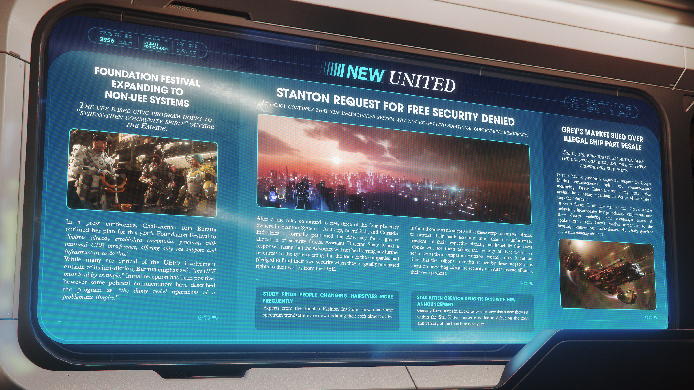

# Alpha 4.9.0：奠基節擴展至非 UEE 星系、斯坦頓免費安全援助請求遭拒、格雷黑市因非法轉售飛船零件被起訴

---

---

<!-- **RELEASE EDITION 4.9.0** -->

**發佈版本 4.9.0**

<!-- **2956** -->

**2956 年**

---

<!-- **NEW UNITED** -->

**NEW UNITED - 新聯合報**

---

<!-- **FOUNDATION FESTIVAL EXPANDING TO NON-UEE SYSTEMS** -->

**奠基節 (Foundation Festival) 擴展至非 UEE 星系**

<!-- **THE UEE BASED CIVIC PROGRAM HOPES TO "STRENGTHEN COMMUNITY SPIRIT" OUTSIDE THE EMPIRE.** -->

**這項基於 UEE 的公民計劃希望在帝國境外「增強社區精神」。**

<!-- In a press conference, Chairwoman Rita Buratta outlined her plan for this year's Foundation Festival to "bolster already established community programs with minimal UEE interference, offering only the support and infrastructure to do this." -->

在一次新聞發布會上，主席 Rita Buratta 概述了她對今年奠基節的計劃，旨在「以最少的 UEE 干預來支持已經建立的社區計劃，僅提供為此所需的支持與基礎設施。」

<!-- While many are critical of the UEE's involvement outside of its jurisdiction, Buratta emphasized: "the UEE must lead by example." Initial reception has been positive, however some political commentators have described the program as "the thinly veiled reparations of a problematic Empire." -->

儘管許多人批評 UEE 參與其管轄範圍以外的事務，但 Buratta 強調：「UEE 必須以身作則。」最初的反響是積極的，然而一些政治評論家將該計劃描述為「一個有問題的帝國欲蓋彌彰的賠償。」

---

<!-- **STANTON REQUEST FOR FREE SECURITY DENIED** -->

**斯坦頓 (Stanton) 免費安全援助請求遭拒**

<!-- **ADVOCACY CONFIRMS THAT THE BELEAGUERED SYSTEM WILL NOT BE GETTING ADDITIONAL GOVERNMENT RESOURCES.** -->

**倡導局 (Advocacy) 確認這個陷入困境的星系將不會獲得額外的政府資源。**

<!-- After crime rates continued to rise, three of the four planetary owners in Stanton System - ArcCorp, microTech, and Crusader Industries - formally petitioned the Advocacy for a greater allocation of security forces. Assistant Director Shaw issued a response, stating that the Advocacy will not be diverting any further resources to the system, citing that the each of the companies had pledged to fund their own security when they originally purchased rights to their worlds from the UEE. -->

在犯罪率持續攀升後，斯坦頓星系四個行星所有者中的三個——ArcCorp、microTech 和 Crusader Industries——正式向倡導局請願，要求分配更多的安全部隊。助理局長 Shaw 發布了回應，表示倡導局不會將任何進一步的資源轉移到該星系，理由是這些公司最初從 UEE 購買其世界權利時，都承諾過將為自己的安全提供資金。

<!-- It should come as no surprise that these corporations would seek to protect their bank accounts more than the unfortunate residents of their respective planets, but hopefully this latest rebuke will see them taking the security of their worlds as seriously as their compatriot Hurston Dynamics does. It is about time that the trillions in credits earned by these megacorps is spent on providing adequate security measures instead of lining their own pockets. -->

這些公司試圖保護自己的銀行帳戶，而不是各自星球上不幸的居民，這應該不足為奇，但希望最新的這番拒絕能讓他們像同儕 Hurston Dynamics 一樣，認真對待他們世界的安全問題。現在是時候將這些巨型企業賺取的數兆信用點花在提供足夠的安全措施上，而不是中飽私囊了。

---

<!-- **GREY'S MARKET SUED OVER ILLEGAL SHIP PART RESALE** -->

**格雷黑市 (Grey's Market) 因非法轉售飛船零件被起訴**

<!-- **DRAKE ARE PURSUING LEGAL ACTION OVER THE UNAUTHORIZED USE AND SALE OF THEIR PROPRIETARY SHIP PARTS.** -->

**德拉克 (Drake) 正針對其專屬飛船零件的未經授權使用和銷售採取法律行動。**

<!-- Despite having previously expressed support for Grey's Market entrepreneurial spirit and counterculture messaging, Drake Interplanetary taking legal action against the company regarding the design of their latest ship, the "Basher." -->

儘管先前曾對格雷黑市的創業精神和反主流文化理念表示支持，德拉克工業（Drake Interplanetary）還是針對該公司最新飛船「Basher」的設計採取了法律行動。

<!-- In court filings, Drake has claimed that Grey's vehicle unlawfully incorporates key proprietary components into their design, violating their company's terms. A spokesperson from Grey's Market responded to the lawsuit, commenting: "We're flattered that Drake spends so much time thinking about us." -->

在法庭文件中，德拉克聲稱格雷的載具在其設計中非法加入了關鍵的專有組件，違反了他們公司的條款。格雷黑市的發言人對這起訴訟作出了回應，評論道：「我們很榮幸德拉克花這麼多時間考慮我們。」

---

<!-- **STUDY FINDS PEOPLE CHANGING HAIRSTYLES MORE FREQUENTLY** -->

**研究發現人們更頻繁地改變髮型**

<!-- Experts from the Rinalco Fashion Institute show that some spectrum trendsetters are now updating their coifs almost daily. -->

來自 Rinalco 時尚學院的專家表明，現在一些 Spectrum 潮流引領者幾乎每天都在更換他們的髮型。

---

<!-- **STAR KITTEN CREATOR DELIGHTS FANS WITH NEW ANNOUNCEMENT** -->

**星際小貓 (Star Kitten) 創作者以新公告讓粉絲大喜**

<!-- Genady Kuzo states in an exclusive interview that a new show set within the Star Kitten universe is due to debut on the 25th anniversary of the franchise next year. -->

Genady Kuzo 在一次獨家採訪中表示，一部以星際小貓宇宙為背景的新劇集將於明年該系列 25 週年之際首播。
