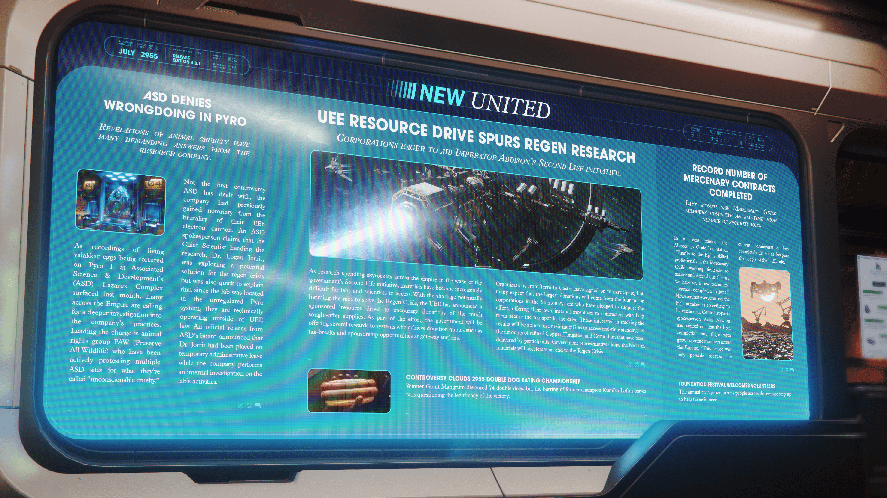

# Alpha 4.2.1：ASD 否認派羅虐行、再生危機研究加速、帝國犯罪率引發擔憂

> \[!NOTE] **發佈版本：** 4.2.1 | **年份：** 2955 年 | **來源：** NEW UNITED - 新聯合報

***

## ASD 否認在派羅的不當行為

> **虐待動物的揭露引發了許多要求該研究公司給出答案的呼聲。**

隨著上個月在派羅 I 的聯合科學與發展公司 (Associates Science & Development, ASD) Lazarus 綜合設施中傳出虐待活體 valakkar 卵的錄音曝光，帝國上下許多人呼籲對該公司的做法進行更深入的調查。領導這項指控的是動物權利組織 PAW (Preserve All Wildlife)，他們一直在積極抗議多個聯合科學與發展公司站點，稱其為「不合情理的殘酷行為」。

這並非聯合科學與發展公司處理的第一起爭議，該公司先前因其 EE6 電子砲的殘酷性而臭名昭著。一名聯合科學與發展公司發言人聲稱，領導該研究的首席科學家 Logan Jorrit 博士正在探索再生危機的潛在解決方案，但他也迅速解釋說，由於實驗室位於不受監管的派羅星系，他們嚴格來說是在 UEE 法律之外運作。聯合科學與發展公司董事會的官方新聞稿宣布，Jorrit 博士已被暫時停職，公司將對實驗室的活動進行內部調查。

## UEE 資源募集刺激再生研究

> **企業渴望協助艾迪森皇帝的第二生命倡議**

隨著政府的第二生命倡議推行，整個帝國的研究支出飛漲，實驗室和科學家越來越難取得材料。由於短缺可能損害解決再生危機的競賽，UEE 宣布了一項贊助的「資源募集」活動，以鼓勵捐贈急需的物資。作為努力的一部分，政府將向達到捐贈配額的星系提供多項獎勵，例如稅收減免和在通道站的贊助機會。

從泰拉到卡斯特拉的組織都已簽約參加，但許多人預計最大筆的捐款將來自斯坦頓星系的四大企業，他們已承諾支持這項努力，並向協助他們確保在此次活動中獲得最高排名的承包商提供內部獎勵。有興趣追踪結果的人將能使用他們的 mobiGlas 來即時查看參與者已交付的精煉銅、鎢和剛玉的數量排名。政府代表希望材料的增加將加速結束再生危機。

## 創紀錄的傭兵合約完成數量

> **上個月，傭兵公會成員完成了歷史新高數量的安全工作。**

傭兵公會在一次新聞稿中表示：「感謝傭兵公會高技能的專業人士不懈努力地保護和捍衛我們的客戶，我們在六月創下了合約完成的新紀錄。」然而，並非所有人都認為這個高數字值得慶祝。中央黨發言人 Acka Newton 指出，高完成率與整個帝國日益增長的犯罪數量一致，「這個紀錄之所以可能，只是因為現任政府完全無法保護 UEE 人民的安全。」

## 基礎節 (Foundation Festival) 歡迎志工

> **這項年度公民計畫見證了整個帝國的人們挺身而出，幫助那些需要幫助的人。**

## 爭議籠罩 2955 年雙層熱狗大胃王錦標賽

獲勝者 Grant Mangrum 吞下了 74 份雙層熱狗，但前冠軍 Kumiko Loftus 遭禁賽，讓粉絲們質疑這場勝利的合法性。
