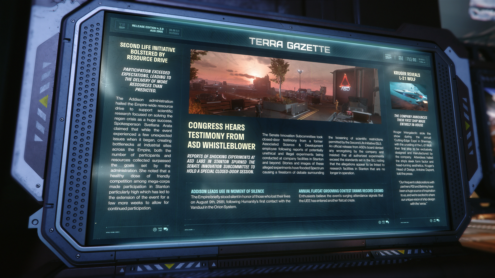

# Alpha 4.3.0：ASD 揭密者聽證會、SLI 資源募集成功與 Kruger L-21 Wolf 發表

> \[!NOTE] **發佈版本：** 4.3.0 | **年份：** 2955 年 | **來源：** TERRA GAZETTE - 泰拉公報

***

## 「第二生命倡議」獲資源募集活動大力支持

> **參與度超出預期，交付的資源超乎預測。**

Addison 政府稱讚全帝國範圍內為支持解決再生危機的科學研究所進行的資源募集活動取得了巨大成功。發言人 Svetlana Arata 聲稱，儘管活動開始時遇到了一些意想不到的問題，導致帝國各地的工業區出現瓶頸，但參與者人數和收集的資源都超過了政府設定的目標。她指出，大型企業之間良性的友好競爭使得斯坦頓 (Stanton) 的參與度尤其高，這導致活動延長了幾週，以便讓參與得以持續。

## 國會聽取來自 ASD 揭密者的證詞

> **關於 ASD 實驗室在斯坦頓進行驚人實驗的報導，促使參議院創新小組委員會舉行了一次特別閉門會議。**

參議院創新小組委員會聽取了一名前聯合科學與發展公司員工的閉門證詞，此前有報導稱該公司在斯坦頓及其他地區的設施中進行了潛在不道德和非法的實驗。有關這些所謂實驗的故事和圖片充斥著 Spectrum，引發了一場關於放寬「第二生命倡議」 (SLI) 所允許的科學限制的激烈辯論。ASD 董事會發布的官方聲明否認了公司的任何不當行為，並堅稱所有授權實驗均超越了 SLI 中設定的標準，同時指出這些指控似乎與斯坦頓已停止營運的研究設施有關。

## KRUGER 揭曉 L-21 WOLF

> **該公司宣布了他們第一艘完全自主研發製造的船艦**

Kruger Intergalactic 在 Sherman 舉行的年度「尖端博覽會」上大放異彩，推出了 L-21 Wolf：這是他們第一艘完全由該公司獨家設計和製造的船艦。與會者盛讚該船艦流線型的外觀和引人注目的美學。Kruger 的設計主管 Antoine Dupont 告訴媒體： 「我們與合作夥伴 RSI 和 Behring 的頻繁合作是我們的巨大靈感來源，我們很高興能與宇宙 ('verse) 分享我們對船艦設計的獨特願景。」

## ADDISON 帶領 UEE 舉行默哀

帝國短暫默哀，紀念 2681 年 8 月 9 日在 Orion 星系與剜度 (Vanduul) 首次接觸後喪生的人們。

## 年度扁臉貓 (Flatcat) 美容大賽吸引了創紀錄的人潮

愛好者認為，活動參與人數激增，標誌著 UEE 已進入另一波扁臉貓熱潮。
