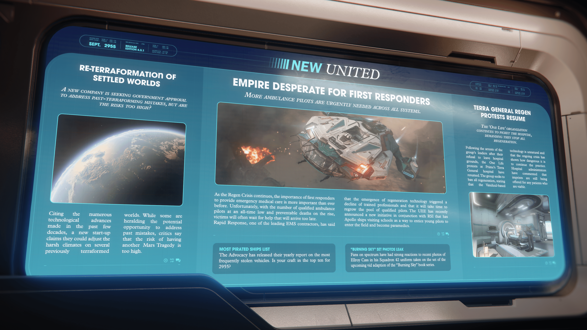

# Alpha 4.3.1：新創公司提議「再地球化」引發風險爭議、再生危機致急救人員嚴重短缺、抗議組織要求醫院停止再生醫療

> \[!NOTE] **發佈版本：** 4.3.1 | **年份：** 2955 年 | **來源：** NEW UNITED - 新聯合報

***

## 已定居世界的再地球化

> **一家新公司正尋求政府批准，以解決過去地球化改造的錯誤，但風險是否過高？**

一家新創公司聲稱，憑藉過去幾十年取得的眾多技術進步，他們可以調整幾個先前已地球化世界的惡劣氣候。儘管有些人預示這可能是解決過去錯誤的潛在機會，但批評者表示，再次發生「火星悲劇」的風險太高。

## 帝國急需急救人員

> **所有星系均迫切需要更多救護車飛行員。**

隨著「再生危機」持續，提供緊急醫療服務的急救人員比以往任何時候都更加重要。不幸的是，合格救護車飛行員的數量創下歷史新低，可預防的死亡人數卻不斷上升，受害者往往只能等待遲來的救援。領先的緊急醫療服務承包商之一「快速反應」表示，再生技術的出現導致訓練有素的專業人員減少，並且需要時間才能重新培養足夠的合格飛行員。UEE 最近宣布了一項與 RSI 合作的新計劃，讓阿波羅號船艦訪問學校，以吸引年輕飛行員投身該領域並成為護理人員。

## 泰拉綜合醫院「再生」抗議活動重燃

> **「一次生命」 (One Life) 組織持續在醫院外舉行抗議，要求他們停止所有再生醫療。**

在該組織領導人因拒絕離開醫院範圍而被捕後，「一次生命」在泰拉星普萊姆綜合醫院的抗議活動又重新開始。該組織尋求禁止所有再生醫療，稱這項基於剜度的技術是不自然的，而且持續的危機表明繼續這種做法是多麼危險。醫院管理人員評論說，他們仍在為任何合適的患者提供「印記」。

## 最常遭海盜劫持的船艦清單

倡議局 (The Advocacy) 發布了關於最常被盜載具的年度報告。您的船艦是否名列 2955 年的前十名？

## 《燃燒的天空》 (Burning Sky) 片場照片外流

粉絲們在光譜 (Spectrum) 上對 Ellroy Cass 穿著 42 中隊 (Squadron 42) 制服的片場照片反應強烈，這些照片是在即將上映的《燃燒的天空》系列叢書改編影片的片場拍攝的。
