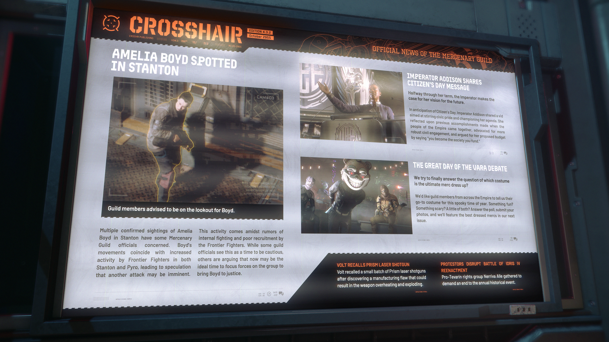

# Alpha 4.3.2：Amelia Boyd 現身斯坦頓、ADDISON 皇帝發表公民日致辭、親特瓦林團體抗議伊德里斯戰役重演

> \[!NOTE] **發佈版本：** 4.3.2 | **年份：** 2955 年 | **來源：** CROSSHAIR - 準心 (傭兵公會官方新聞)

***

## 在斯坦頓發現 AMELIA BOYD 蹤跡

> **建議公會成員留意 Boyd 的動向。**

多起經確認的 Amelia Boyd 目擊報告出現在斯坦頓，引起了傭兵公會部分官員的擔憂。Boyd 的行動與「Frontier Fighters」在斯坦頓和派羅日益頻繁的活動相吻合，引發了另一次攻擊可能迫在眉睫的猜測。此活動發生之際，正值「Frontier Fighters」內部傳出內訌和招募不順的謠言。雖然一些公會官員認為此時應保持謹慎，但其他人則主張，現在可能是集中力量對付該組織、將 Boyd 繩之以法的理想時機。

## ADDISON 皇帝分享公民日致辭

> **任期過半，皇帝闡述了他對未來的願景。**

在公民日前夕，ADDISON 皇帝分享了一段影片，旨在激發公民自豪感並倡導他的議程。他回顧了帝國人民團結一致時取得的成就，倡導更健全的公民參與，並在為他的預算提案辯護時說：「你資助什麼樣的社會，你就會成為什麼樣的社會。」

## VARA 節日大辯論

> **我們試圖最終回答這個問題：哪種服裝是傭兵的終極裝扮？**

我們希望帝國各地的公會成員告訴我們，在這個詭異的時節，他們的首選服裝是什麼。有趣的？嚇人的？還是兩者兼具？請回答投票，提交您的照片，我們將在下一期中專題報導穿著最棒的傭兵。

## VOLT 召回 PRISM 雷射霰彈槍

Volt 在發現製造缺陷可能導致武器過熱和爆炸後，召回了一小批 Prism 雷射霰彈槍。

## 抗議者擾亂伊德里斯戰役 (Battle of Idris) 重演活動

支持特瓦林 (Tevarin) 的權利團體「Nerriva Alle」聚集起來，要求停止這項年度歷史活動。
