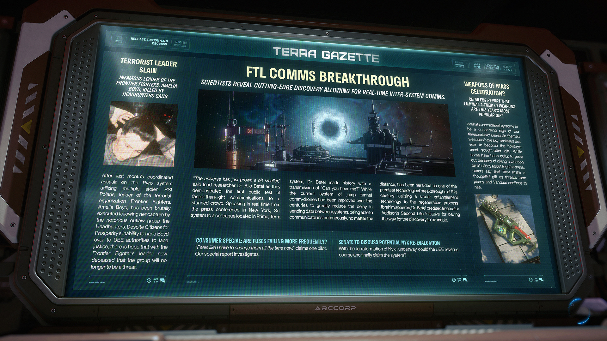

# Alpha 4.5.0：恐怖組織頭目遭獵頭幫處決、超光速即時通訊技術問世、光明節主題武器成熱門禮物

> \[!NOTE] **發佈版本：** 4.5.0 | **年份：** 2955 年 | **來源：** TERRA GAZETTE - 泰拉公報

***

## 恐怖份子頭目被殺

> **惡名昭彰的邊境戰士 (Frontier Fighters) 領袖阿梅莉亞·博伊德 (Amelia Boyd) 遭獵頭幫 (Headhunters) 殺害。**

在上個月利用多艘被盜的羅伯茨太空工業 (RSI) 北極星 (Polaris) 對派羅 (Pyro) 星系發動協同攻擊後，恐怖組織「邊境戰士」的領袖阿梅莉亞·博伊德在被惡名昭彰的非法組織獵頭幫俘虜後遭到殘忍處決。儘管「繁榮公民」 (Citizens for Prosperity) 組織無法將博伊德移交給聯合地球帝國當局接受正義審判，但人們希望隨著邊境戰士領袖的死亡，該組織將不再構成威脅。

## 超光速 (FTL) 通訊突破

> **科學家揭露尖端發現，實現即時跨星系通訊。**

「宇宙剛剛變小了一點，」首席研究員阿洛·貝特爾 (Allo Betel) 博士在向震驚的群眾展示首次公開測試的超光速通訊時說道。貝特爾博士從位於太陽系 (Sol) 紐約的新聞發布會現場，向位於泰拉 (Terra) 星系普萊姆 (Prime) 的一位同事即時發話，以一句「你能聽到我說話嗎？」創造了歷史。雖然跳躍通道通訊無人機系統在過去幾個世紀中已有所改進，大幅減少了星系間傳送數據的延遲，但無論距離多遠都能夠進行瞬間通訊，被譽為本世紀最偉大的技術突破之一。利用與伊布拉欣球 (Ibrahim spheres) 再生過程類似的糾纏技術，貝特爾博士歸功於艾迪森 (Addison) 皇帝的「第二生命倡議」，認為這為此項發現鋪平了道路。

## 大規模慶祝武器？

> **零售商報告指出，光明節 (Luminalia) 主題武器是今年最受歡迎的禮物。**

在一些人認為這是令人擔憂的時代跡象中，光明節主題武器的銷量在今年激增，成為節日最受追捧的禮物。雖然有些人迅速指出在一個象徵團聚的節日贈送武器具有諷刺意味，但其他人則表示，隨著來自海盜和剜度 (Vanduul) 的威脅持續上升，這是一份貼心的禮物。

## 消費者特輯：保險絲故障是否越來越頻繁？

> 「感覺我現在必須一直更換它們，」一位飛行員聲稱。

我們的特別報導將進行調查。

## 參議院將討論重新評估尼克斯 (Nyx) 的可能性

隨著尼克斯 I 的地球化改造正在進行，聯合地球帝國 (UEE) 是否會改變方針並最終宣稱該星系的主權？
