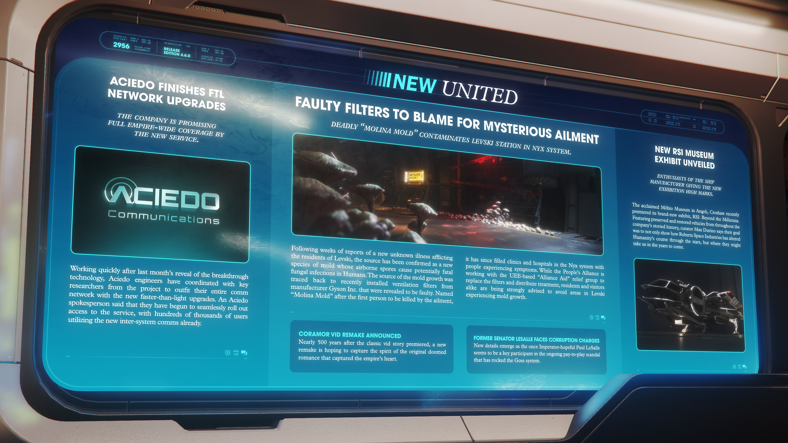

# Alpha 4.6.0：Aciedo 完成全帝國超光速網路升級、尼克斯星系列夫斯基站爆發致命黴菌感染、羅伯茨太空工業歷史特展於克羅肖星系開幕

> \[!NOTE] **發佈版本：** 4.6.0 | **年份：** 2956 年 | **來源：** NEW UNITED - 新聯合報

***

## Aciedo 完成超光速 (FTL) 網路升級

> **該公司承諾新服務將覆蓋整個聯合地球帝國 (UEE)。**

在上個月揭曉突破性技術後，Aciedo 的工程師們迅速行動，與專案的主要研究人員協作，為其整個通訊網路配備了全新的超光速升級。Aciedo 發言人表示，他們已開始無縫推出該服務的使用權限，目前已有數十萬用戶在使用新的跨星系通訊。

## 故障過濾器為神秘疾病的主因

> **致命的「莫里納黴菌」 (Molina Mold) 污染了尼克斯 (Nyx) 星系的列夫斯基 (Levski) 站。**

在連續數週關於列夫斯基居民患上新型不明疾病的報導後，來源已被確認為一種新型黴菌，其空氣傳播的孢子會導致人類致命的真菌感染。黴菌生長的源頭追溯至製造商 Gyson Inc. 最近安裝的通風過濾器，這些過濾器被證實存在缺陷。這種疾病以第一位死於該病的受害者命名為「莫里納黴菌」，此後尼克斯星系的診所和醫院擠滿了出現症狀的民眾。雖然人民聯盟 (People's Alliance) 正與總部位於聯合地球帝國的「聯盟援助」 (Alliance Aid) 救援組織合作更換過濾器並分發治療藥物，但仍強烈建議居民和遊客避開列夫斯基出現黴菌生長的區域。

## 羅伯茨太空工業 (RSI) 博物館新展覽揭幕

> **這家飛機製造商的愛好者對新展覽給予了高度評價。**

位於克羅肖 (Crowshaw) 星系安吉利 (Angeli) 的知名莫希奧 (Mohio) 博物館最近首映了其全新展覽「RSI：跨越千禧」 (RSI: Beyond the Millennia)。館長 Max Durino 表示，展覽展出了該公司傳奇歷史中保存與修復的載具，他們的目標不僅是展示羅伯茨太空工業如何改變了人類在星際間的進程，還展示了他們在未來幾年可能引領我們走向何方。

## 寇拉莫 (Coramor) 影片翻拍版發佈

在這部經典影片故事首映近 500 年後，一部新的翻拍作品希望能捕捉到最初那段擄獲帝國之心的悲劇羅曼史精髓。

## 前參議員 Lesalle 面臨貪腐指控

隨著新細節的浮現，曾有望成為執政官的 Paul LeSalle 似乎是目前震驚高斯 (Goss) 星系的「錢權交易」醜聞中的關鍵參與者。
