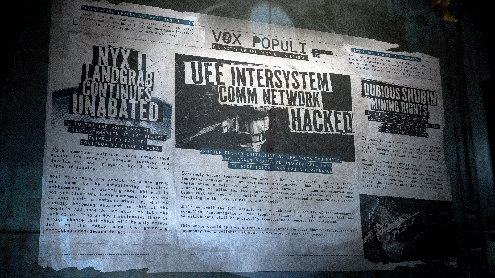

# Alpha 4.7.0：尼克斯 I 爆發土地爭奪熱潮、聯合地球帝國跨星系通訊網遭駭客攻擊、舒賓星際非法出售礦業權益引發爭議

> \[!NOTE] **發佈版本：** 4.7.0 | **年份：** 2956 年 | **來源：** VOX POPULI - 人民聯盟之聲

***

## 誘餌魚 (Triggerfish) 惡作劇一點也不好玩

了解如何保護自己免受所謂「尋歡作樂者」的傷害，因為這個傷人的節日再次威脅要以「找樂子」為名毀掉每個人的一天。

## 列夫斯基 (Levski) 就業博覽會宣告成功

最近一場活動的組織者表示，該活動吸引了涵蓋從採礦到傭兵工作等各個領域的多家承包商，這導致尼克斯 (Nyx) 的就業率大幅飆升。

## 尼克斯 (Nyx) 土地爭奪戰持續升級

> **隨著該行星實驗性地球化改造 (Terraformation) 的完成，利益相關方正持續宣示主權。**

隨著在其最近更新的表面建立了眾多前哨站，席捲尼克斯 I 的開發熱潮毫無放緩跡象。

最令人擔憂的是有關一個新團體的報告，他們似乎正以驚人的速度建立強化定居點。雖然目前尚不清楚這些尼克斯新客是誰或其意圖為何，但迅速顯現的事實是：如果人民聯盟 (People's Alliance) 不開始認真對待在尼克斯 I 定居的任務，那麼當管理委員會最終決定採取行動時，恐怕只剩下殘羹剩飯了。

## 聯合地球帝國 (UEE) 跨星系通訊網遭駭客攻擊

> **這個崩潰中的帝國又一次草率推行的倡議，再次證明了其令人無法接受的缺乏深思熟慮與基本治理能力**

艾迪森 (Addison) 大帝及其急功近利的政府似乎沒從拙劣引進的重生技術中吸取任何教訓，才剛完成利用未經測試的新技術對通訊網絡進行全面翻修以實現跨星系即時傳輸，隨即就傳出這個剛公開的網絡遭遇大規模數據外洩，導致數百萬 Alpha 遊戲幣 (aUEC) 損失的消息。

在我們等待駭客攻擊的完整細節以及監察部 (Advocacy) 所謂「調查」結果的同時，人民聯盟強烈建議所有敏感數據仍應透過實體運輸以確保其安全。

這整個卑劣的事件再次提醒人們，雖然進步是必要且不可避免的，但必須以審慎的理智來加以調和。

## 令人質疑的舒賓 (Shubin) 礦業權

> **隨著這家大型財團持續掠奪該星系，許多礦工開始質疑他們在尼克斯的地位。**

諷刺的是，QV 行星服務公司 (QV Planet Services) 的幽靈竟然被另一家對人民聯盟及其理想漠不關心的礦業公司復活了。

在對星系內殘留資源進行勘探後，舒賓星際 (Shubin Interstellar) 已開始出售基格帶 (Keeger Belt) 附近廢棄的 QV 拆解站 (QV Breaker Stations) 的礦業權。但許多當地礦工都在想，舒賓到底憑什麼擁有出售這些權益的權利？
