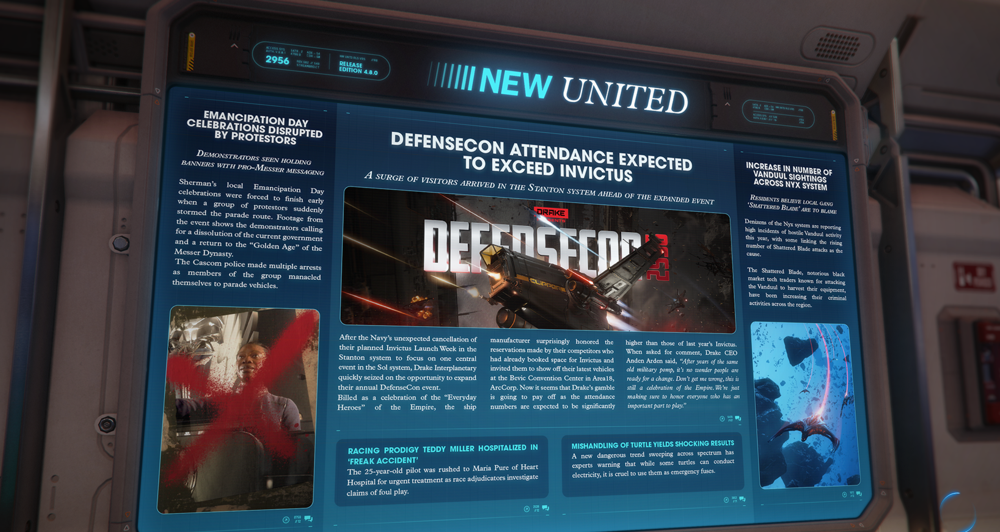

# Alpha 4.8.0：「戰術打擊」行動重塑前線後勤、保險機制改革引發經濟波動、加油員俱樂部正式成立

> \[!NOTE] **發佈版本：** 4.8.0 | **年份：** 2956 年 | **來源：** NEW UNITED - 新聯合報

***

## 解嚴日 (Emancipation Day) 慶祝活動遭抗議者中斷

> **示威者被發現手持帶有支持麥瑟 (Pro-Messer) 訊息的橫幅**

謝爾曼（Sherman）當地的解嚴日慶祝活動因一群抗議者突然衝入遊行路線而被迫提前結束。活動現場畫面顯示，示威者呼籲解散現政府，並回歸麥瑟王朝（Messer Dynasty）的「黃金時代」。

隨著該團體成員將自己鎖在遊行車輛上，Cascom 警方已逮捕了多名人士。

## DefenseCon 出席人數預期將超越 Invictus

> **隨著活動規模擴大，大量訪客在盛會開幕前湧入史丹頓 (Stanton) 星系**

在海軍出人意料地取消了原定於史丹頓星系舉行的 Invictus Launch Week（轉而集中在太陽系舉辦單一大型活動）後，德拉克工業（Drake Interplanetary）迅速把握機會，擴張了其年度 DefenseCon 活動的規模。

這場被宣傳為慶祝帝國「日常英雄」的盛會中，這家飛船製造商令人驚訝地保留了競爭對手原先為 Invictus 預訂的展位，並邀請他們在 ArcCorp 區 Area18 的 Bevic 會展中心展示最新的載具。現在看來德拉克的這場豪賭即將獲得回報，預計出席人數將顯著高於去年的 Invictus。

當被要求置評時，德拉克執行長 Anden Arden 表示：「在經歷了多年一成不變的軍事壯觀場面後，難怪人們已經準備好迎接改變。別誤會，這依然是對帝國的慶祝，我們只是確保向每一位扮演重要角色的人致敬。」

## Nyx 星系 Vanduul 目擊事件數量增加

> **居民認為應歸咎於當地幫派「碎刃」(Shattered Blade)**

Nyx 星系的居民報告今年敵對 Vanduul 活動頻傳，部分人將此與「碎刃」幫派攻擊次數上升聯繫起來。

「碎刃」是以攻擊 Vanduul 並收割其設備而聞名的臭名昭彰黑市技術交易商，他們一直在該地區增加犯罪活動。

## 競賽天才 Teddy Miller 因「怪異意外」住院

這位 25 歲的飛行員被緊急送往 Maria Pure of Heart 醫院接受治療，與此同時，競賽裁判正在調查有關比賽作弊的指控。

## 不當處理烏龜導致震驚結果

一項席捲 Spectrum 的危險新趨勢讓專家發出警告：雖然某些烏龜可以導電，但將其當作緊急保險絲使用是非常殘忍的。
