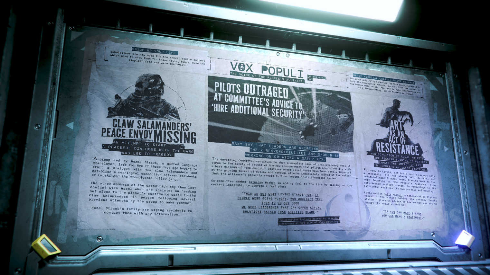

# Alpha 4.8.1：爪蠑螈和平使者失蹤、飛行員對委員會建議「聘請額外安全人員」感到憤怒、藝術作為抵抗的行為

> \[!NOTE] **發佈版本：** 4.8.1 | **年份：** 2956 年 | **來源：** VOX POPULI - 人民聯盟之聲

***

## 為生活增添風味

年度食譜大賽現已開放投稿，該活動旨在展示「在這些艱難的時期，即使是最簡單的食物也能溫暖人心。」

## 仁慈醫院 (Mercy Hospital) 慈善募款活動延期

原定於本月舉行、旨在幫助這家陷入困境的醫院從莫里納黴菌 (Molina Mold) 危機影響中恢復的活動，因門票售出情況令人失望而無限期延期。

## 爪蠑螈 (Claw Salamanders) 和平使者失蹤

> **試圖與該幫派展開和平對話的嘗試已導致悲劇。**

由富有語言天賦的翻譯家 Hazel Straub 率領的團隊於三天前出發前往尼克斯 II (Nyx II)，希望能與爪蠑螈 (Claw Salamanders) 展開對話，並在列夫斯基 (Levski) 居民與這個棘手的歹徒幫派之間建立有意義的聯繫。

探險隊的其他成員表示，在該團隊幾次嘗試接觸後，Hazel 堅持獨自前往行星表面與爪蠑螈 (Claw Salamanders) 親自交談，隨後他們便與她失去了聯繫。

Hazel Straub 的家人正敦促居民如有任何線索請與他們聯繫。

## 飛行員對委員會建議「聘請額外安全人員」感到憤怒

> **許多人表示領導者正在規避責任，應致力於創造一個更安全的尼克斯 (Nyx)。**

管理委員會在對待列夫斯基 (Levski) 的安全問題上繼續表現出完全的無知，他們最新宣布飛行員現在飛行時應至少配備「一名護航員」。生計受到日益嚴重的歹徒與 Vanduul 襲擊威脅深切影響的船長們，立即對聯盟的安全應進一步成為他們財務負擔的說法感到反感。

前委員會成員 Barnabus Harbek 呼籲現任領導層提供一項真正的計劃，這無疑是火上澆油：

> 「這不是列夫斯基 (Levski) 創立的宗旨。如果人們快要挨餓，你不會叫他們去買食物。我們需要的是能夠提供實際解決方案的領導層，而不是推卸責任。」

截至本刊印前，委員會並未對此做出任何回應。

## 藝術作為抵抗的行為

> **一個由當地藝術家組成的新聯盟正在尋求資金，以進一步擴大藝術在人民聯盟 (People's Alliance) 站點中的影響力。**

對於列夫斯基 (Levski) 的許多人來說，藝術不只是一件奢侈品，它是一項必需品。從人民聯盟 (People's Alliance) 創立之初，藝術在此處便一直具有文化與政治意義。從反麥瑟 (anti-Messer) 的抗議作品，到洗手間裡的塗鴉，每一件都有其獨特的宗旨與意義。

當地藝術家 Felix Yabuki 是 Anthony Tanaka 雕像創作者 Alyisha Yabuki 的後裔，他為我們如何利用藝術影響周遭世界提供了建議：

> 「如果你能留下印記，你就能表明立場。」
