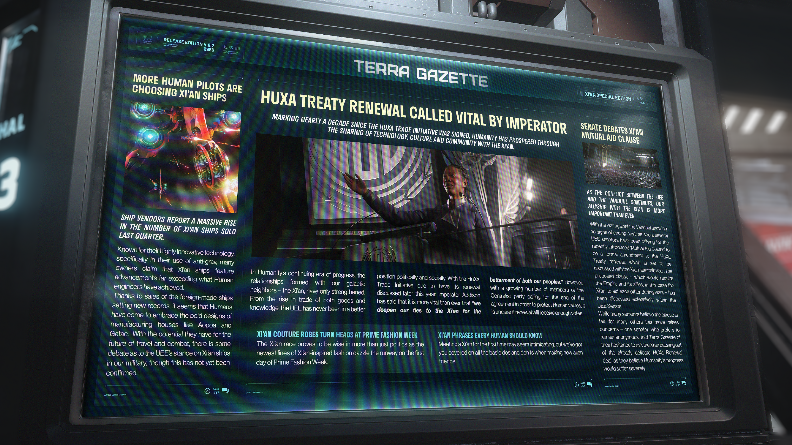

# Alpha 4.8.2：皇帝稱續簽克安條約至關重要、人類飛行員青睞克安飛船、參議院辯論克安互助條款

> \[!NOTE] **發佈版本：** 4.8.2 | **年份：** 2956 年 | **來源：** TERRA GAZETTE - 泰拉公報：西安特別版

***

## 更多人類飛行員選擇西安飛船

> **飛船經銷商報告上季度西安 (Xi'an) 飛船銷售量大幅增長。**

西安 (Xi'an) 飛船以其高度創新的技術（特別是反重力技術的使用）而聞名，許多船主聲稱西安飛船的技術進步已遠遠超越人類工程師所達到的水平。

隨著這款外國製造飛船的銷量創下新紀錄，人類似乎已開始接受奧波亞 (Aopoa) 和蓋塔克 (Gatac) 等製造商的大膽設計。鑑於這些飛船在未來旅行與戰鬥中的潛力，目前對於聯合地球帝國 (UEE) 讓西安飛船加入我軍的立場存在一些爭論，儘管這一點尚未得到證實。

## 皇帝稱續簽西安條約至關重要

> **標誌著自《HuXa 貿易倡議》簽署近十年以來，人類藉由與西安 (Xi'an) 分享技術、文化和社群而繁榮發展。**

在人類持續進步的時代中，與我們銀河鄰居——西安 (Xi'an) 建立的關係日益鞏固。從物資到知識貿易的興起，聯合地球帝國 (UEE) 在政治與社會層面上均處於前所未有的極佳狀態。隨著《HuXa 貿易倡議》將於今年晚些時候進行續約討論，艾迪森 (Addison) 皇帝表示，「為了我們雙方人民的福祉，深化我們與西安的聯繫」比以往任何時候都更為關鍵。然而，隨著越來越多中庸黨 (Centralist) 成員為了保護人類的價值觀而呼籲終止該協定，目前尚不清楚續約是否能獲得足夠的票數支援。

## 西安高級訂製長袍在普萊姆 (Prime) 時裝週引人矚目

西安 (Xi'an) 族證明了他們不僅在政治上充滿智慧，其最新款的西安風尚系列服飾在普萊姆 (Prime) 時裝週首日便閃耀伸展台。

## 每個人類都應該知道的西安 (Xi'an) 片語

初次與西安 (Xi'an) 接觸可能會感到有些畏懼，但我們為您整理了在結交新外星朋友時的所有基本注意事項與禁忌。

## 參議院辯論西安 (Xi'an) 互助條款

> **隨著 UEE 與剜度 (Vanduul) 之間的衝突持續，我們與西安 (Xi'an) 的盟友關係比以往任何時候都更為重要。**

由於與剜度 (Vanduul) 的戰爭短期內沒有結束的跡象，數名 UEE 參議員一直極力爭取將最近提出的「互助條款 (Mutual Aid Clause)」作為《HuXa 條約》續簽的正式修正案，該條約將於今年晚些時候與西安 (Xi'an) 進行討論。這項擬議的條款——要求帝國及其盟友（在此指西安）在戰爭期間互相援助——已在 UEE 參議院內部進行了廣泛的討論。

儘管許多參議員認為該條款是合理的，但對其他許多人來說，此舉引發了擔憂——一位要求匿名的參議員告訴《泰拉公報》 (Terra Gazette)，他們遲疑是否要冒著讓西安 (Xi'an) 退出本已脆弱的《HuXa 續簽》談判的風險，因為他們深信，如果沒有此合約，人類的發展進步將遭受嚴重打擊。
